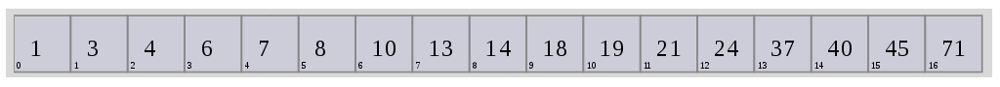
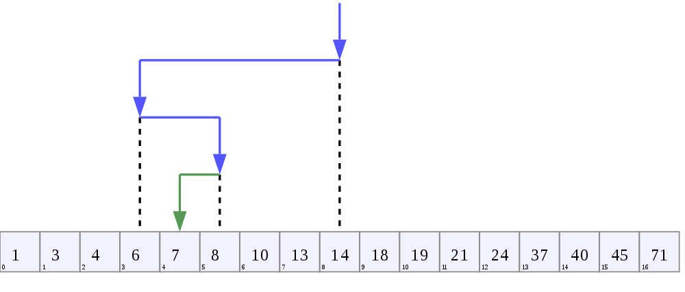

include::./_settings_deck.adoc[]
// include::../../../_settings_reveal.adoc[]

// beige, blond, default, moon, night, serif, simple, sky, solarized
// :revealjs_customtheme: reveal.js/css/theme/serif.css

= Search and Sort

= Searching
[quote]
___________________________________________
Check if an element exists in array & return its index
___________________________________________

= Unsorted List

[source,javascript,numbered]
-------------------------------------------
function findMax(arr, value) {
  for (var i=0; i<arr.length; i++) {
    if (arr[i] == value)
      return i;
  }

  return -1;
}
-------------------------------------------

-> Complexity?

= Can we do better on sorted list?

= Binary search

* Complexity?

= Sorting

* There is `arr.sort()`
* But how does it work?

= Selection sort

"Successively find smallest element" 

* Find smallest element
* Move it to beginning
* Repeat on sub-array

= Selection sort

image::https://i.stack.imgur.com/qa2Cg.gif[,80%]

= Merge sort

"Successively merge sorted sets" 

* Merging two already sorted arrays is fast
* Divide and conquer
   - Make problem really small (DIVIDE)
   - Sort really small array (CONQUER)
   - Then recursively go back
   - And merge the already sorted arrays

= Merge Sort - Divide

image::http://interactivepython.org/courselib/static/pythonds/_images/mergesortA.png[,50%]

= Merge Sort - Conquer

image::http://interactivepython.org/courselib/static/pythonds/_images/mergesortB.png[,50%]
