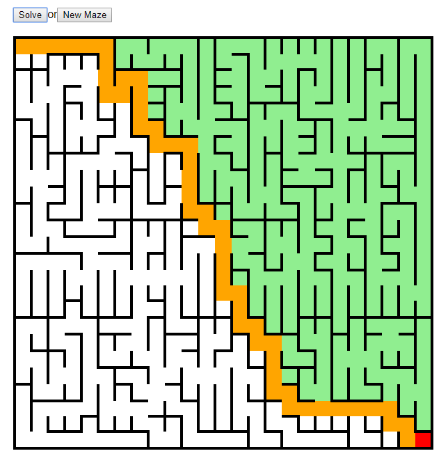

# Exercises

## Exercise 0 - Multiplication
1. write a function multiply(a,b) which multiply a and b by only using + and - operators
1. write it recursive first

## Exercise 1 - Binary Search
1. [Revisit the algorithm](./search.md#binary-search-algorithm)
1. Write test
1. Implement the binary search

Hint - there are multiple ways to do this. Bonus points if you can come up with a solution that does not make copies of the array. Even more bonus points if you can manage to do this without recursive function calls.

## Exercise 2 - Recursive Maze
1. Write a function that finds the exit in a Maze
1. Use the provided framework. Fill in MazeSolver.js
 [Framework](./exercises/recursion_maze)
 1. How complex is your solution?
 

Bonus point (bit difficult): find length of shortest path and find shortest path.
Extra Bonus point (difficult, a lot JS/HTML magic needed): make it so you can follow the algorithm (see it on the page)  while it is searching the path.

## Exercise 3 - Selection sort

1. [Revisit the algorithm](./sorting.md#algorithm-1-selection-sort)
1. Write test
1. Implement selection sort

Hint - there are multiple ways to do this. Bonus points if you manage to come up with a solution that does works on the input array only, and does not require any additional lists.

## Exercise 4 - Merge sort

1. [Revisit the algorithm](./sorting.md#algorithm-2-merge-sort)
1. Write test
1. Implement merge sort

## Bonus Exercise 1 - Quick sort
1. [Read up on quicksort](https://en.wikipedia.org/wiki/Quicksort)
2. Write test
3. Implement quick sort

